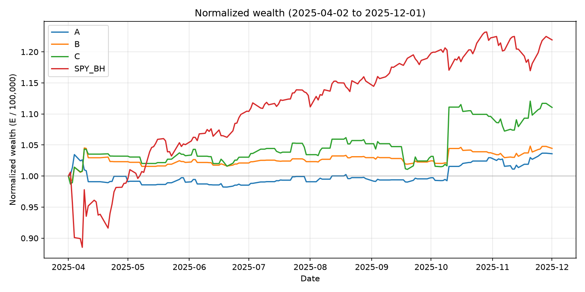
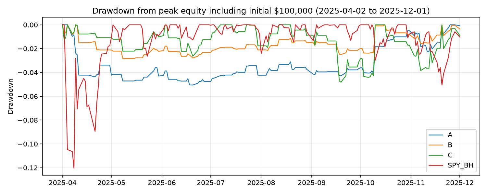
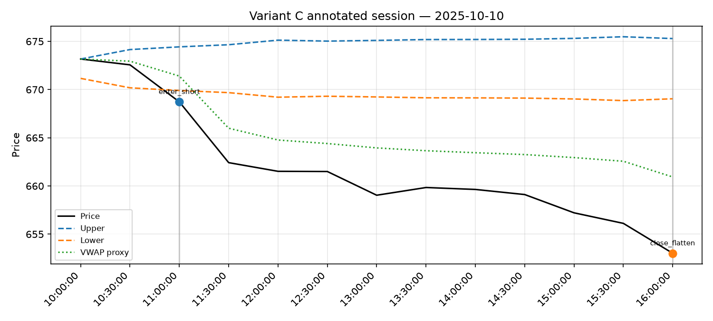

# B9339 Systematic Investment Strategies — Homework Assignment #1

**Student:** Young Kim  
**Course:** B9339, Professor Achilles Venetoulias, Fall 2026  
**Due:** Tuesday, September 22, 2026, 5:00pm EST  

**AI coding platform:** Cursor (model name/version unknown — not displayed in session)  
**Related AI use:** ChatGPT prepared the detailed implementation brief from the homework PDF and paper, and assisted review instructions for later revisions (ChatGPT model unknown / not recorded).  

**Paper:** Zarattini, Aziz, Barbon, *Beat the Market: An Effective Intraday Momentum Strategy for S&P500 ETF (SPY)* (this version 22 Sep 2025)  
**Data:** Instructor Bloomberg workbook `hw1.spy.20250313-20251201.intra-30m.xlsx` (unchanged original in `data/raw/`)  

**Results generated:** 2026-09-22T16:02:57 (final analysis rerun); Figure 1 regenerated with corrected E/100000 normalization in this revision.  
**Tests:** 17 passed (`python -m pytest tests/ -q`)
**PDF render:** `python scripts/render_report.py` (plain-text formulas; no LaTeX commands in PDF)
---

## Summary of answers (Step 3 deliverables)

**1. AI development.** Cursor generated a from-scratch Python replicator of the paper’s three nested variants. Authors’ published code was not used. Development, corrections, and verification are documented in Section 1.4 and Appendix E (full prompts). Independent reference arithmetic and ledger P&L checks passed; these checks were AI-performed.

**2. Findings.** On 2025-04-02 through 2025-12-01 (168 sessions after 14-session band warm-up), net of paper costs ($0.0035 commission + $0.001 slippage per share per side): **A +3.59404%** (Sharpe **0.82958**), **B +4.45905%** (Sharpe **0.93934**), **C +11.05656%** (Sharpe **1.09023**). Matched **SPY buy-and-hold on the supplied Last Price series** returned **+21.92754%** (Sharpe **1.49478**). Tighter exits raised turnover and did **not** lower annualized volatility versus A in this sample. One day (2025-10-10) accounts for about **85.6%** of C’s total net dollar profit—important short-sample concentration. Delayed fills damaged C far more than the tested slippage increases.

**3. Strategy assessment.** The economic idea is time-series momentum conditioned on unusually large same-clock moves from the open. It is computationally runnable on a laptop but live trading needs reliable data/clocks, shorting, fills, and risk controls. Attractiveness versus buy-and-hold is not established in this eight-month window.

**4. Paper critique.** The sequential A→B→C design is clear and pedagogically useful. Headline ~19.6% / Sharpe ~1.33 figures are historical backtest references for ~2007–early 2024, not targets for our sample. Average-absolute-move bands are heuristics. Table 6’s Monday t-statistic of 1.84 satisfies |t| > 1.65 (approximate two-sided 10% threshold), so the prose claim that Monday lacks significance is inconsistent with that threshold.

---

## 1. AI development and accuracy (Step 3.1)

### 1.1 Platform choice

We used **Cursor** to read the assignment/paper, generate and edit Python in-repo, run tests, and iterate on errors in one workspace. We used **Python** for Excel ingestion, transparent transforms, `pytest`, and figures. These are workflow reasons, not a claim that Cursor is objectively best.

ChatGPT’s role was upstream brief-writing and later review guidance, not the primary coding environment for the replicator.

### 1.2 What we replicated and omitted

**Replicated:** Noise Area from 14-day average absolute open-to-endpoint moves with gap adjustment; semi-hourly decisions; flatten by session close (13:00 on half-days); variants **A** (opposite-band), **B** (current-band + VWAP stop, 1x), **C** (B + 2% daily vol target, 4x cap); paper baseline costs; SPY buy-and-hold on matched dates.

**Omitted from core:** full candlestick-pattern study (30-minute endpoints cannot reconstruct true highs/lows); dealer-gamma modeling (no options data); VIX/cross-asset tests (not supplied); exhaustive weekday filters (weak subgroup power in ~168 days).

### 1.3 Main formulas (as implemented)

Absolute move and 14-day average (plain text):

```
a_(d-i,h) = |P_(d-i,h) / O_(d-i) - 1|
m_(d,h)   = (1/14) * sum_{i=1..14} a_(d-i,h)
```

Noise-band boundaries with overnight gap adjustment (VM = 1 by default):

```
U_(d,h) = max(O_d, C_(d-1)) * (1 + VM * m_(d,h))
L_(d,h) = min(O_d, C_(d-1)) * (1 - VM * m_(d,h))
```

Here `m` is an average absolute move, not a standard deviation.

**Adaptation:** `O_d` is the first regular bar’s endpoint price (`open_proxy`), treated as known at 10:00 under the bar-start timing assumption—not a verified 09:30 open. First ordinary entry is at the next endpoint (typically 10:30 availability). The gap adjustment therefore spans overnight plus the first half-hour.

Endpoint-weighted VWAP proxy with interval volumes `v_j`:

```
VWAP_proxy_(d,h) = sum_{j<=h} (P_(d,j) * v_(d,j)) / sum_{j<=h} v_(d,j)
```

**Sizing (C):** daily close returns `r_j = C_j / C_(j-1) - 1`;  
`sigma_d = sample_stdev(r_(d-14), ..., r_(d-1))` with ddof=1;  
`exposure_d = min(4, 0.02 / sigma_d)`;  
`shares_d = floor(E_(d-1) * exposure_d / O_d)`.  
For A/B, exposure = 1. Share quantity is calculated when the day’s 10:00 opening proxy becomes available, then held fixed for that session (not resized after later fills).

**B/C operational entry:** long only if `P > max(U, VWAP)`; short only if `P < min(L, VWAP)`. Equality does not trigger entry or stop.


### 1.3.1 Reported risk and return statistics

Daily portfolio equity `E_d` is end-of-day wealth after all fills and costs (strategies are flat overnight). Flat days (zero return) remain in the series used below.

```
Daily portfolio return:     r_d = E_d / E_(d-1) - 1
Annualized volatility:      ann_vol = sample_stdev(r_1,...,r_N) * sqrt(252)
Sharpe ratio:               Sharpe = mean(r_1,...,r_N) / sample_stdev(r_1,...,r_N) * sqrt(252)
Drawdown on day d:          DD_d = E_d / max(E_initial, E_1, ..., E_d) - 1
Maximum drawdown:           MDD = min_d DD_d
```

Sample standard deviation uses `ddof=1`. The Sharpe formula above uses this report's **zero risk-free-rate** assumption (so excess returns equal raw daily returns). Annualized geometric return in the tables is separate: `(E_N / E_0)^(252/N) - 1`.


### 1.4 Development process (actual)

Coding platform: Cursor. Brief prepared with ChatGPT. Full prompt text: Appendix E.

**Issue 1 — Half-day unit-test assertion.** Discovered on first pytest run (13/14; TypeError). Cause: a broken test line `assert all(... if False else True)` (test bug, not strategy bug). Fix: assert max(available_at) <= 13:00. Evidence: later 17/17 pass. Effect on strategy metrics: none.

**Issue 2 — Delay-fill state machine clarity.** Discovered while implementing fill_mode=delay_one before trusting delay sensitivities. Cause: initial pending/queue draft was hard to reason about. Fix: rewrite delay path (fill pending, then queue; cancel if next bar is close). Evidence: delay sensitivities run in pipeline. Effect: no before/after metric pair was saved for an earlier buggy delay run; only final delay metrics exist.

**Issue 3 — Drawdown definition.** Methodology audit in revision. Peak path should include initial $100,000. Fix: concatenate initial equity before EOD path. Effect: no change to headline MDDs in this sample.

**Issue 4 — Report hit-ratio prose.** Ledger recomputation showed B/C trade win rate 0.42963 is higher than all-days win rate 0.27381 (flat days). Corrected definitions and direction. Narrative only.

**Issue 5 — Wealth-figure normalization (this revision).** Figure 1 previously divided by first-day *closing* equity, so C appeared to end near 1.125. Correct normalization is E / 100000, including an initial point at 1.0. Chart-only bug; backtest unchanged.

**Issue 6 — Missing P&L worked example.** Added independent short round-trip arithmetic and a ledger reconciliation test for 2025-10-10.

### 1.5 Verification summary (AI-performed)

| Property | Method | Outcome | Tol. | Result |
|----------|--------|---------|------|--------|
| Gap-adjusted bands | Hand fixture + reference_checks | Match | 1e-12 | Pass |
| VWAP from interval volumes | ref_vwap vs production | Equal | exact | Pass |
| A hold / B earlier stop | State-machine unit tests | As specified | n/a | Pass |
| Reversal trades 2Q shares | _apply_fill(+Q to -Q) | traded=200 | exact | Pass |
| Half-day flatten | Synthetic + real ledgers | No post-13:00; flat EOD | n/a | Pass |
| No future leakage | Alter later bar | Earlier fills unchanged | exact | Pass |
| Sizing lag | Alter same-day close | Opening shares unchanged | exact | Pass |
| Real bands/VWAP 2025-07-03 & 2025-10-10 | reference vs production | Diff 0 | 0 | Pass |
| Real P&L 2025-10-10 short | Hand arithmetic vs ledger | Net = Delta equity | 1e-6 | Pass |

---

## 2. Data and findings (Step 3.2)

### 2.1 Data and timing conventions

Sheets: `AV.Clean` (main intraday), `BBRG.Intraday`, `BBRG.Daily` (closes from 2025-02-20). Intraday coverage 2025-03-13 through 2025-12-01 (182 sessions). December 1 is included in the core sample; a through-November sensitivity is also reported.

**Timestamps.** Original labels are preserved as `clock_label`. Under the inferred bar-start convention, information availability is label+30 minutes for regular bars (09:30 -> 10:00, ..., 15:30 -> 16:00). Evidence: 15:30 price equals 16:00 on 121/182 days; large 09:30 volumes; separate close rows. This is not authoritative Bloomberg metadata.

**Open.** No Open field exists. We use the first regular endpoint as `open_proxy` (known at 10:00 availability). This is an adaptation, not exact replication of the paper’s 09:30 open rule.

**Volume.** We treated `Volume, AV` observations as interval amounts because values frequently decrease within a session (1,181 decreases). Closing 16:00 residuals were not used in trading-time VWAP.

**Half-days (2025-07-03, 2025-11-28).** Post-13:00 labeled rows were removed from trading and afternoon band history. Usable morning/early bars through the 13:00 close were retained. Positions flatten at 13:00.

**14-session band history after half-days.** For availability clock `h`, we take the last 14 prior sessions that have an observation at `h`, skipping missing clocks. That can span more than 14 calendar sessions while still averaging 14 observations. If fewer than 14 priors exist, bands are NaN (no trade).

**Close / last bar.** Liquidation uses `session_close_price` (aligned to daily close within $0.0003 when possible). We do not create an extra holding interval between two simultaneous close prints.

**Benchmark (SPY_BH).** Buy floor(100000 / prior_close) shares using the prior close of the first evaluation day as entry (2025-04-02 entry 557.76980 -> 179 shares; residual cash held). Daily mark-to-market on supplied closes; zero commissions/slippage in the core benchmark. Described as return on the supplied price series until adjustment/dividend basis is verified.

**Maximum drawdown.** Peak-to-trough on end-of-day equity including the initial $100,000 point.

### 2.2 Volume reconciliation discrepancies (observed)

| Date | Sum AV.Clean | Daily volume | Difference |
|------|-------------:|-------------:|-----------:|
| 2025-03-13 | 77,456,149 | 74,079,416 | +3,376,733 |
| 2025-04-17 | 40,044,740 | 79,868,080 | -39,823,340 |
| 2025-04-23 | 61,312,864 | 90,590,656 | -29,277,792 |
| 2025-04-25 | 37,455,103 | 61,119,592 | -23,664,489 |
| 2025-05-09 | 24,629,063 | 37,603,428 | -12,974,365 |
| 2025-09-22 | 48,564,894 | 69,452,200 | -20,887,306 |
| 2025-11-03 | 41,710,084 | 57,315,024 | -15,604,940 |

**Treatment:** keep prices; do not back-allocate residuals into earlier bars.  
**Why trading-time VWAP is largely unaffected:** VWAP uses pre-close interval volumes only. Inference that 16:00 is often a reconciliation residual is not proven construction metadata.

### 2.3 Core results

Evaluation window after warm-up: 2025-04-02 through 2025-12-01, N=168 sessions, start equity $100,000. Risk-free rate = 0 for Sharpe and regressions.



**Figure 1.** Normalized wealth = equity / 100,000, including an initial point at 1.0 before the first session. Variant C ends at 1.11057, matching 111056.56150 / 100000. SPY_BH compounds overnight moves; A/B/C are flat overnight.



**Figure 2.** Drawdowns from running equity peaks including the initial $100,000.

**Table A — Levels and returns**

| Strategy | End equity | Total return | Ann. return | Ann. vol | Sharpe | Max DD |
|----------|------------:|-------------:|------------:|---------:|-------:|-------:|
| A | 103594.04020 | 0.03594 | 0.05439 | 0.06649 | 0.82958 | -0.05060 |
| B | 104459.05340 | 0.04459 | 0.06763 | 0.07241 | 0.93934 | -0.02836 |
| C | 111056.56150 | 0.11057 | 0.17035 | 0.15490 | 1.09023 | -0.04818 |
| SPY_BH | 121927.53580 | 0.21928 | 0.34633 | 0.21409 | 1.49478 | -0.12034 |

Annualized return above is geometric: `(E_end/E_start)^(252/N) - 1` with N=168.

**Table B — Hit rates and trade counts**

| Strategy | Win/all days | Win/traded days | Trade win rate | Fill events | Round trips |
|----------|-------------:|----------------:|---------------:|------------:|------------:|
| A | 0.32143 | 0.58696 | 0.58947 | 187 | 95 |
| B | 0.27381 | 0.50000 | 0.42963 | 270 | 135 |
| C | 0.27381 | 0.50000 | 0.42963 | 270 | 135 |
| SPY_BH | 0.58929 | N/A | N/A | 0 | 0 |

**Definitions.** Fill events = each ledger row where shares change (entries, exits, reversals, close flats). A reversal is one fill that closes one side and opens the other (2Q shares traded). Completed trades = round trips from inventory. Day win/all includes 76 flat days for A/B/C. Breakeven completed trades: none observed.

**Hit-ratio clarification.** For B/C, completed-trade win rate (0.42963) is higher than all-days win rate (0.27381) because including 76 flat days lowers the all-days win rate. Relative to A’s trade win rate (0.58947), B/C’s trade win rate is lower—consistent with tighter stops—while comparing trade win rate to all-days win rate as if they measured the same quantity is invalid.

**Volatility.** Annualized volatility rose from A (0.06649) to B (0.07241) in this sample; tighter exits did not reduce realized vol here (they did reduce max drawdown for B). C’s vol (0.15490) rises with leverage.

**Concentration (useful short-sample check).** On 2025-10-10, Variant C’s net dollar P&L was 9464.68800. C’s total net profit over the evaluation window was 11056.56150. That single day is 9464.68800 / 11056.56150 = **0.85602** (about 85.6%) of C’s cumulative net dollars. This does not prove the strategy is invalid, but it shows how dependent this eight-month result is on one large short-side winner.

**Regression (C on SPY daily returns, HAC maxlag=5):** alpha_daily = 0.00070 (ann. 252*alpha = 0.17573), beta = -0.02140, R^2 = 0.00088.

**Bootstrap Sharpe (C):** block length 5, 1000 resamples, seed 42; point 1.09023; approx. 95% CI about [-1.30, 2.74]—wide.

**Through November (C, ends 2025-11-28, N=167):** total return 0.11711, Sharpe 1.15191, MDD -0.04818.

### 2.4 Worked trade example (Variant C, 2025-10-10) — AI arithmetic



**Figure 3.** Price, Noise Area bands, VWAP proxy, and fills on 2025-10-10 (Variant C).

1. Date / availability: 2025-10-10, entry at 11:00:00 availability.  
2. Prices: P=668.72500, U=674.43126, L=669.90251, VWAP=671.40110. Short threshold min(L,VWAP)=669.90251.  
3. Why short: P < min(L,VWAP) -> BC_enter_short.  
4. Sizing: E=101639.32240; sigma=0.00404519; exposure=min(4, 0.02/sigma)=4.00000; O=673.17000; shares=floor(E*4/O)=603.  
5. Exit: 16:00 session_close_flatten at 653.02000.  
6. Gross (short): (668.72500 - 653.02000) * 603 = 9470.11500.  
7. Costs: each side 603 * 0.0045 = 2.71350; both sides 5.42700.  
8. Net: 9470.11500 - 5.42700 = 9464.68800, matching Delta equity that day.

Half-day check (2025-07-03, C): long 501 at 11:00, flatten 13:00; net ~15.48090 equals that day’s equity change; no post-13:00 fills.

### 2.5 Robustness (exploratory; headline parameters unchanged)

Headline: lookback=14, VM=1, cap=4, slippage=$0.001, endpoint fills, VWAP on.

**Lookbacks on matched window 2025-04-10 -> 2025-12-01 (N=162)**

| Label | Total return | Sharpe | Max DD |
|-------|-------------:|-------:|-------:|
| A_lb10 | 0.00155 | 0.07022 | -0.03981 |
| A_lb14 | 0.02557 | 0.72526 | -0.02755 |
| A_lb20 | -0.00525 | -0.11321 | -0.03270 |
| B_lb10 | -0.00438 | -0.11593 | -0.03107 |
| B_lb14 | -0.00048 | 0.00883 | -0.02832 |
| B_lb20 | 0.01562 | 0.54593 | -0.01760 |
| C_lb10 | 0.06286 | 0.71736 | -0.05467 |
| C_lb14 | 0.06449 | 0.73042 | -0.04817 |
| C_lb20 | 0.08830 | 0.98330 | -0.04353 |

Matched-window B_lb14 is nearly flat even though full-window B is positive—early April matters. Not used to retune headlines.

**VM, caps, costs, delay, band-only (N=168 unless noted)**

| Setting | Total return | Sharpe | Max DD |
|---------|-------------:|-------:|-------:|
| C_vm0.75 | 0.05252 | 0.55075 | -0.07658 |
| C_vm1.00 (headline) | 0.11057 | 1.09023 | -0.04818 |
| C_vm1.50 | 0.15242 | 1.58046 | -0.03858 |
| C_cap1x | 0.05371 | 1.18263 | -0.01810 |
| C_cap2x | 0.07738 | 1.13056 | -0.03136 |
| C_cap4x (headline) | 0.11057 | 1.09023 | -0.04818 |
| C_slip 0.001 | 0.11057 | 1.09023 | -0.04818 |
| C_slip 0.005 | 0.10560 | 1.04627 | -0.04898 |
| C_slip 0.010 | 0.09940 | 0.99162 | -0.05002 |
| C_delay | 0.03902 | 0.54637 | -0.05500 |
| C_band_only | 0.11019 | 1.08663 | -0.04852 |
| C through Nov (N=167) | 0.11711 | 1.15191 | -0.04818 |

**Cost vs delay.** Raising slippage from $0.001 to $0.01 cuts C’s Sharpe from 1.09023 to 0.99162. One-bar delayed fills cut Sharpe to 0.54637. Delay is much more material than the tested linear slippage range.

**Leverage-cap experiment.** Cap 1x has the highest Sharpe (1.18263) and smallest MDD (-0.01810) but lowest total return among caps. Cap 2x is an intermediate trade-off—discussed as a risk-control illustration, not a uniquely optimal choice.

---

## 3. Strategy assessment (Step 3.3)

**Economic hypothesis.** Following unusually large same-clock moves from the open treats those moves as evidence of persistent order-flow imbalance or slow information incorporation (time-series momentum). Bands are a heuristic “noise region,” not a direct measure of imbalance.

**What A, B, and C accomplish.** A stays with the breakout until the opposite band. B exits when price crosses the current-direction band or VWAP proxy—truncating some reversals but increasing whipsaws (270 vs 187 fill events). C scales share count to recent daily volatility, raising dollar exposure after calm periods.

**Interesting / attractive for whom?** Interesting as a transparent intraday TS-momentum case study for investors who can short SPY, tolerate turnover, and supervise automation. Not shown to be attractive versus buy-and-hold for this window, especially given one-day concentration in C’s P&L.

**Laptop?** Computation: yes. Reliable live operation needs synchronized clock/calendar (half-days), clean data, broker connectivity, shorting permissions, fill quality, monitoring, and kill switches—not implemented here.

**Critical conditions.** Intraday trend persistence; liquidity; timely execution; costs; volatility regime interacting with leverage; trustworthy timestamps/opens.

**Better/worse regimes.** Better when imbalances persist; worse in choppy mean reversion, news reversals between 30-minute prints, and quiet markets paired with high leverage.

**Course connections.** This homework sits squarely in the course’s systematic-investing agenda as framed by the assignment itself: building a rule-based strategy from a published paper, then testing it on real data with explicit transaction costs. The paper’s base rule is a **time-series momentum** idea (follow an instrument’s own recent move), in the lineage the authors cite from Jegadeesh and Titman (cross-sectional momentum) and Moskowitz, Ooi, and Pedersen (time-series momentum)—contrasting with cross-sectional “winners vs losers” sorts. The assignment explicitly flags the paper’s **stop/loss refinement** and **volatility-targeted leverage** as course-relevant improvements; our A→B→C comparison isolates exactly those two design choices. The **dynamic Noise Area** is a time-of-day risk/range filter rather than a static band. Performance reporting through alpha/beta versus SPY, Sharpe ratios, drawdowns, and cost sensitivity matches the course emphasis on evaluating strategies with risk-adjusted and implementation-aware metrics, not headline returns alone. Finally, documenting AI-assisted construction and verification is itself part of this assignment’s learning goal for modern systematic research workflows.

**Other markets.** Hours, auctions, liquidity, participants, hedging flows, costs, and shorting rules differ—SPY results do not imply transfer.

**Underemphasized risks.** Stops only every 30 minutes; path risk between prints; leverage after low-sigma windows; false breakouts; data/timestamp error; short constraints; capacity/impact; model-selection bias; overnight market risk for an investor who holds other equity overnight even if this book flats; and, in short samples, dependence on a few large days.

**Improvements.** Lower leverage caps reduce MDD (and can raise Sharpe) while cutting total return. Implementation hygiene is correctness, not a new edge.

---

## 4. Critical review of the paper (Step 3.4)

**Interest / usefulness / realism.** The paper is interesting and useful: a readable signal and a sequential comparison of exits and sizing (Tables 1–3, Section 3). Realism is mixed—costs are discussed (Section 4.6; FAQ I-Star), but idealized timing and small slippage experiments do not certify all regimes/AUM.

**Headline metrics.** Abstract/Table 3’s ~19.6% annualized return and Sharpe ~1.33 for May 2007–early 2024 are historical reference values, not forecasts and not targets for our 2025 instructor sample.

**Leverage and benchmarks.** Dynamic sizing drives much of B→C improvement in the paper; comparing leveraged active returns to 1x buy-and-hold requires that caveat. We only claim price-series returns on supplied Last Prices.

**Noise Area.** Average absolute move is not a significance test or proven equilibrium region (Section 3).

**Execution / VWAP / costs.** Semi-hourly decisions reduce noise sensitivity but leave intrabar risk. In our sample, delay stress hurt much more than raising slippage within the tested grid.

**Patterns / weekdays / VIX.** Multiple overlapping conditionings invite selection bias; mean != 0 is not pairwise superiority (Tables 5–6, Sections 4.1–4.3).

**Monday inconsistency.** Table 6 reports Monday average PnL with t = 1.84. Under the paper’s approximate two-sided 10% rule of thumb (|t| > 1.65, i.e. outside about -1.65 to +1.65), Monday meets that threshold. Yet the weekday prose says Monday shows “no statistical significance.” That is a prose-versus-table inconsistency under the paper’s own 10% rule.

**RSI / gamma.** Section 4.5 uses a price-based RSI proxy, not measured dealer gamma.

**Parameters / publication.** Low parameter count aids clarity but does not eliminate research-design risk. FAQ post-publication updates are still authors’ backtests.

**How to present better.** Explicit fill/state tables; consistent windows; uncertainty; economic cost schedules; chronological out-of-sample protocol; clearer boundary between mechanisms and evidence.

---

## Reproduction

```bash
cd systematic_investment_strategies
python3 -m venv .venv
source .venv/bin/activate
pip install -U pip
pip install -r requirements.txt
pip install -e .
# Required input:
#   data/raw/hw1.spy.20250313-20251201.intra-30m.xlsx
python -m pytest tests/ -q
python scripts/run_analysis.py
python scripts/render_report.py
```

---

## Appendix A — Assignment compliance checklist

| Requirement | Where | Status |
|-------------|-------|--------|
| Step 1a AI-produced code | Section 1; src/sis_hw1/ | Done |
| Step 1b Language choice | Section 1.1 Python | Done |
| Step 1c Not authors’ primary code | Section 1 | Done |
| Step 1d Verify accuracy | Section 1.5; App. C | Done (AI checks) |
| Step 1e Select/omit threads | Section 1.2 | Done |
| Step 2 Real data + anomalies + half-days | Section 2 | Done |
| Step 3.1–3.4 | Sections 1–4 | Done |
| First-page summary | Summary | Done |
| Formulas explained | Section 1.3 | Done |
| Prompts used | Appendix E (full text in report/PDF) | Done |
| Group identity | Young Kim (solo) | Done |
| Readable PDF formulas/tables | plain-text formulas; split Tables A/B; `scripts/render_report.py` | Done |
| Figure 1 = E/100000 with initial 1.0 | fixed plot_wealth; caption reconciles to 1.11057 | Done |

---

## Appendix B — State transitions (implemented)

| State | Condition | Next |
|-------|-----------|------|
| Flat / A | P > U | Long |
| Flat / A | P < L | Short |
| Long / A | P < L | Short (reverse) |
| Long / A | else | Hold (including inside band) |
| Short / A | P > U | Long (reverse) |
| Flat / B,C | P > max(U, VWAP) | Long |
| Flat / B,C | P < min(L, VWAP) | Short |
| Long / B,C | P < max(U, VWAP) | Flat, or Short if also P < min(L, VWAP) |
| Short / B,C | P > min(L, VWAP) | Flat, or Long if also P > max(U, VWAP) |
| Any | Session-close bar | Flat (forced) |

---

## Appendix C — Verification artifacts

- `logs/verification_report.md`
- `logs/pytest_revision.txt` (17 passed)
- `logs/pytest_initial.txt` (documents original half-day **test** failure)
- `outputs/traces/C_2025-10-10_*.csv`
- `src/sis_hw1/reference_checks.py`

---

## Appendix D — Supporting outputs map

| Path | Content |
|------|---------|
| `outputs/tables/core_summary.csv` | Headline metrics |
| `outputs/tables/sensitivity.csv` | Full robustness grid |
| `data/processed/audit_report.json` | Audit + anomalies |
| `outputs/ledgers/` | Daily/trades/bars |
| `backups/pre_revision_20260922/` | Pre-revision snapshot |

---

## Appendix E — Prompts used (full text)

The coding platform was Cursor. The two substantive user prompts that produced the implementation and draft write-up are reproduced below (extracted from the session transcript). A later PDF-formatting revision prompt is omitted from this appendix. Minor system/task notices are omitted.

### E.1 Prompt 1 — Planning (2026-09-22)

```
/Users/youngkim/Downloads/hw1 (1).pdf
/Users/youngkim/Downloads/hw1.spy.20250313-20251201.intra-30m.xlsx
/Users/youngkim/Downloads/ZarattiniAzizBarbon.202509.BeatTheMarketAnEffectiveIntradayMomentumStrategyForS&P500ETF(SPY).pdf

help me work on this project. let's first plan and understand what the project's looking for
```

**Purpose:** Scope the assignment before coding.

### E.2 Prompt 2 — Full implementation brief (2026-09-22)

This long brief (prepared with ChatGPT from the homework and paper) instructed Cursor to implement variants A/B/C, audit the workbook, verify correctness, run analysis, and draft the write-up. Full text:

```
ou are my AI coding and quantitative-research assistant for B9339 Systematic Investment Strategies, Professor Achilles Venetoulias, Fall 2026, Homework Assignment #1. Complete the implementation, verification, empirical analysis, and a polished, evidence-backed draft write-up. This is an academic replication exercise explicitly requiring AI-generated code. Success means a correct, reproducible and critically assessed experiment, whether the strategy makes or loses money.

Read this entire prompt and both PDFs before implementing anything. Follow the homework PDF as the authority for assignment requirements and the attached paper as the authority for strategy definitions. Treat my specifications below as the intended scope and safeguards; identify and explain any conflict with the source documents rather than silently resolving it. Work through the task to completion, run the code and checks, inspect outputs, and correct actual errors. Do not stop at a plan or a scaffold. Do not place trades or connect a brokerage account.

1. Inputs and assignment requirements

Expected inputs in this workspace:

hw1 (1).pdf: the complete assignment.

ZarattiniAzizBarbon.202509.BeatTheMarketAnEffectiveIntradayMomentumStrategyForS&P500ETF(SPY).pdf: the September 22, 2025 version of the paper.

hw1.spy.20250313-20251201.intra-30m.xlsx: the instructor's Bloomberg data. The assignment describes approximately March–November 2025 SPY ending prices and accumulated volumes at 30-minute intervals. Inspect the actual workbook; its filename is not sufficient evidence of its contents, date coverage, or timestamp semantics.

Any additional course materials or notes I have actually supplied.

Find these inputs recursively without modifying originals. If the workbook is missing, tell me the exact missing filename immediately, continue with source analysis, implementation and explicitly synthetic unit tests, and leave empirical outputs blocked until real data are supplied. Never substitute synthetic data, daily data, or an unrelated dataset and present it as the required empirical analysis. Do not fabricate results to make the report appear complete.

The assignment requires:

AI-generated implementation; disclose the chosen platform and why.

Independent verification of correctness, which may use manual calculations, an independently written checker, another AI, or authors' code only for checking/correcting the AI-generated implementation.

An explained selection of which parts of the paper to replicate and omit.

Testing on real data; identifying and reporting actual or suspected data anomalies; handling the July 3 and November 28, 2025, 13:00 closes.

Detailed documentation of prompts, iterations, corrections and implementation accuracy.

Results, relevant comparative statistics, robustness, and discussion of how the available data constrain the replication choices.

Assessment of the strategy and a critical review of the paper, answering every question in Step 3.

A first-page summary covering all four Step 3 deliverables; explained formulas and assumptions sufficient for a classmate to reproduce the work from the write-up.

At least five decimal places for numerical answers where appropriate. Use full precision internally and sensible units. Counts and dates need not have decimals. Five-decimal display is not evidence of statistical precision.

Clear, organized software output, with row and column headings in spreadsheet printouts, if used.

One write-up for a group of at most three. Do not invent group members, identities or contributions; leave those fields for me to fill in.

2. Provenance and a truthful AI-process record

Use Python for a transparent local research project. Explain the choice: Python supports Excel ingestion, inspectable data transformations, numerical analysis, testing and reproducible plots; Cursor supports code generation, file editing, execution and iterative debugging in one workspace. These are reasons for the chosen workflow, not claims that Cursor is objectively the best platform.

Generate the main implementation yourself from the paper. Do not download and use the authors' implementation as the primary replicator, copy an existing strategy repository, or merely wrap someone else's backtester. If authors' code is later consulted for verification, retain citations, explain precisely what was compared and changed, and keep its verification role distinct from the primary implementation. An independent small reference implementation and worked arithmetic checks are sufficient; external authors' code is not mandatory.

From the beginning, keep:

This exact initial prompt and all subsequent user prompts actually available to you.

Platform, model name/version if actually visible, date, Python version and dependencies. Mark unknown model details as unknown rather than guessing.

A chronological experiment and correction log: what was attempted, observed output or error, diagnosis, actual correction, test evidence, and resulting change in metrics if applicable.

The initial working implementation and final implementation, using snapshots or local git commits if appropriate. Do not overwrite the only evidence of the first working version.

A record of data conventions, assumptions, deviations from the paper, and source citations/page references.

Do not manufacture a history of failed prompts or fixes, claim manual checks were performed by me, claim a second AI reviewed the code unless one actually did, or write that I personally verified something I have not reviewed. Label AI-performed arithmetic checks and AI-generated prose accurately. Preserve the fact that this initial prompt was prepared with ChatGPT from the homework and paper; the coding platform for the replication is Cursor. Do not invent the model used by ChatGPT. Leave a short final checklist of any student-specific facts, class connections and judgments needing my confirmation.

3. Replication scope and rationale

Replicate these three nested variants on identical evaluation dates:

A. Original breakout strategy: time-of-day noise bands, long/short entries, opposite-band exit/reversal, 1× beginning-of-day equity exposure.

B. Improved exits: same noise-band idea, exit at the current-direction band or session VWAP, 1× exposure.

C. Improved exits plus dynamic sizing: B with trailing daily-volatility-based sizing, 2% daily underlying-volatility target and a 4× exposure cap.

This isolates the paper's two main improvements: exit design and leverage adjustment. Include SPY buy-and-hold as the main benchmark over matched dates and explicitly identify its price-return or total-return basis.

Prioritize these core variants, correctness, execution/VWAP sensitivity, costs, and a small predeclared parameter analysis. Do not turn this homework into a search for the most profitable parameter combination.

Omit from the core replication the full daily-candlestick-pattern study, direct dealer-gamma modeling, broad cross-asset backtests, and exhaustive VIX/weekday filters. Explain each exclusion: 30-minute endpoints do not reconstruct true daily highs/lows; actual gamma requires options positions/exposure assumptions and additional data; VIX and other markets are absent unless supplied; eight months offers limited subgroup power. A weekday descriptive table or five-day RSI relationship may be an optional appendix only after required work is complete. If using RSI, label it as a price-based proxy and do not present it as measured dealer gamma. Never infer historical highs and lows from endpoints and call them actual OHLC data.

4. Audit the workbook before designing the backtest

Inspect sheets, headers, metadata, cell types, date/time layout, hidden assumptions and sample records. Build a data dictionary and preserve raw-to-clean row provenance. Document:

Actual first/last date, session count, rows per session, timestamp timezone, bar start/end convention, price meaning, volume meaning, and availability of genuine opening and previous-session closing prices.

Duplicate and conflicting timestamps, unsorted records, missing bars, nontrading dates, out-of-session records, missing/nonpositive prices, nonfinite values, negative/zero volume, nonmonotonic cumulative volume, stale prices, suspicious jumps and inconsistent session endpoints.

Whether volume is an interval amount or a cumulative session total. Use labels/metadata and observed behavior; do not infer solely because values look plausible. If ambiguous, document the evidence and alternative treatment.

Whether raw prices are adjusted/unadjusted, whether dividends/corporate actions are documented, and whether supplemental data would be consistent. Do not quietly splice adjusted daily prices into unadjusted intraday prices.

Standard US equity sessions in America/New_York and the special 13:00 closes on 2025-07-03 and 2025-11-28. Account for daylight saving time if timestamps are UTC. Use a suitable exchange calendar where available, with these dates explicitly verified. Do not use a fixed UTC offset or treat every weekday as a full session.

Keep a table with anomaly date/time, observed issue, evidence, resolution and impact. Distinguish a suspicious but genuine market move from a verified bad print. Do not delete large moves merely because they hurt performance. Deduplicate only with explicit rules. Never silently forward-fill missing tradable prices, synthesize a 16:00 close on a half-day, or mark missing data as a flat zero-return day.

Define a conservative policy for incomplete sessions and show sensitivity if exclusions are material. Daily close observations may still be valid for close-to-close volatility even when intraday data are incomplete; distinguish the daily series from the strategy session-eligibility series. Do not bridge unaccounted multiday price gaps and label them one-day returns. Explain the performance calendar when sessions are excluded and distinguish known cash days from unknown P&L.

Opening prices and warm-up

The paper requires the 09:30 open. A 10:00 interval-ending price is not the opening price. A record labeled 09:30 may itself have ambiguous meaning; inspect rather than assume. If the true open is unavailable, first check whether another sheet supplies it. Otherwise report the limitation and either use a clearly disclosed, consistently sourced supplemental open or implement a separately labeled approximation. Do not claim exact replication when substituting the first observed endpoint for the open. Replacing the open changes the signal definition, not just a minor data detail.

Require 14 prior valid trading sessions for the band estimate and 14 prior daily close-to-close returns for sizing; the latter generally requires 15 closing observations. Specify the additional previous close needed on the first trading day. Do not use future rows to initialize early signals. Report warm-up losses and the resulting common evaluation start date. Supplemental prehistory may be used if legitimately available, consistently defined, cited and included with the submission; do not let a paid-data requirement block the core homework.

For time-of-day band history, specify how half-days or missing historical endpoints affect the 14-session window. Preserve the intended last-14-trading-session definition where possible. If using the last 14 available observations at a given clock time, identify it as a deviation that can span more than 14 sessions. Compare a reasonable alternative if this affects results. Never interpolate unobserved afternoon prices on half-days.

4A. Workbook-specific findings and implementation overrides

The actual workbook has now been inspected. The following findings supersede generic possibilities elsewhere in this prompt. Reproduce these checks in your own audit, retain the distinction between observations and interpretations, and log this supplied audit as input from ChatGPT, not as discoveries you independently made before receiving it.

Sheet selection and coverage

Sheet

Observed contents

Role

AV.Clean

Columns A:C: Time Stamp, Last Price, Volume, AV; 2,544 data rows, newest first

Main supplied cleaned intraday source, subject to the issues below

BBRG.Intraday

Columns B:D: timestamp, last price, volume; 2,542 data rows, newest first; an additional SMAVG (15) column

Raw comparison and provenance; do not use its moving-average column as a strategy indicator

BBRG.Daily

Columns B:D: timestamp, last price, volume; 197 daily observations, newest first

Prior close, daily-volatility prehistory, close/volume reconciliation and benchmark support

Intraday coverage is March 13–December 1, 2025 inclusive, with 182 distinct session dates. Daily coverage begins February 20, 2025 and includes 15 dates before the intraday sample. Sort each dataset ascending before computing lags, cumulative sums, differences or rolling windows. Include December 1 in the full supplied-data analysis and state this explicitly, notwithstanding the assignment's approximate March–November description. If useful, show a through-November sensitivity rather than quietly dropping December 1.

The 180 ordinary sessions have all 14 recorded clock labels from 09:30 through 16:00 at 30-minute intervals. The two half-days have 12 rows each. The audit found no duplicate intraday timestamps, missing/nonpositive prices or negative volumes, and every daily date within the intraday span is represented. These checks do not establish that timestamps and volume allocation are economically correct.

Volume is not a running cumulative total

Volume, AV repeatedly decreases as the day progresses. For example, on December 1, the recorded 09:30 row has 6,398,375 shares and the 10:00 row has 3,953,647. There are 1,181 within-session decreases across the file. Treat regular intraday volumes as per-record/interval amounts, not cumulative session totals. Do not difference this column. Accumulate eligible interval volumes yourself when constructing the endpoint-weighted VWAP proxy.

The closing rows need separate treatment. Compared with the raw sheet, the cleaned sheet changes or adds 176 records, all timestamped 16:00. On 175 of 182 sessions, the sum of all cleaned volumes exactly equals the daily volume, and the 16:00 value equals daily volume minus the sum of earlier records. This strongly suggests a volume-reconciliation residual; it is not proof that all that volume actually traded in a final interval or closing auction. No explanatory cell formulas/comments identify its construction. Retain it for auditing and do not back-allocate it into earlier intraday VWAPs. Use ordinary pre-close bar volumes for trading-time VWAP. At the close, flatten regardless of VWAP, so an unverified closing residual need not affect any new signal.

Seven dates fail the all-row volume reconciliation. Record these observed values exactly, investigate, and do not silently manufacture interval allocations:

Date

Sum of AV.Clean volume

BBRG.Daily volume

Sum minus daily

2025-03-13

77,456,149

74,079,416

+3,376,733

2025-04-17

40,044,740

79,868,080

-39,823,340

2025-04-23

61,312,864

90,590,656

-29,277,792

2025-04-25

37,455,103

61,119,592

-23,664,489

2025-05-09

24,629,063

37,603,428

-12,974,365

2025-09-22

48,564,894

69,452,200

-20,887,306

2025-11-03

41,710,084

57,315,024

-15,604,940

The March 13 excess exactly equals its first recorded volume. This is consistent with that first record being omitted when deriving a balancing residual, but do not present the construction as proven. On the other six dates, the raw 16:00 volume is nonzero and is unchanged in the cleaned sheet; that is relevant evidence, not proof of which trading intervals are missing volume. Keep usable price history unless there is a separate price defect. Explain why closing-volume discrepancies may have little effect on pre-close signals if they concern only an unused closing residual; do not automatically discard these entire dates or assume the discrepancy is harmless.

Early-close rows are not tradable afternoon observations

On both July 3 and November 28, the recorded labels are 09:30, 10:00, 10:30, 11:00, 11:30, 12:00, 12:30, 13:00, 14:00, 15:00, 15:30 and 16:00. Prices are repeated after the close. Volumes at 13:00, 14:00, 15:00 and 15:30 are zero. The 16:00 cleaned rows contain 18,991,361 shares on July 3 and 17,387,935 on November 28, despite the actual 13:00 market close.

Remove post-13:00 labels from tradable data and afternoon band-history observations. Preserve the raw rows and audit them. Do not relabel these volume residuals as real 13:00 trades or infer an extra afternoon session. Use the closing price at the real session close and flatten once. Under the inferred bar-start convention below, the 12:30 regular bar ends at 13:00; the 13:00/16:00 repeated-price records must not become additional half-hour returns or trades.

Timestamp interpretation and the missing true open are the main limitations

There is no explicit opening-price field in any of the three sheets. All price columns are Last Price. There is no authoritative timezone/bar-label explanation in the sheet headers or cell comments.

The pattern strongly suggests bar-start labels for regular 30-minute bars: the 15:30 price equals the separate 16:00 closing price on 121 of 182 dates (including the half-days' stale records), and most remaining differences are small; on both half-days the 12:30 price already equals the 13:00 close. The large 09:30 volume and separate closing records are also consistent with this interpretation. These are internal indications, not authoritative Bloomberg metadata.

Seek any available instructor/vendor clarification. If no authoritative clarification is available, use the inferred bar-start convention as the main conservative timing assumption: regular rows labeled 09:30 through 15:30 become observations available at 10:00 through 16:00, and half-day regular rows labeled 09:30 through 12:30 become available at 10:00 through 13:00. Do not mechanically shift the special closing/stale rows into 16:30 or a nonexistent afternoon session. Preserve original labels separately from availability times. At the terminal endpoint, resolve the final regular-bar price versus the separate closing print consistently; use the closing print for final liquidation and do not create an extra half-hour holding period between two observations available at the close. State that idealized close execution still has the limitations described in Section 6.

Do not use the row labeled 09:30 as a verified 09:30 opening price. Under the main timing assumption it is the first bar's ending price, known at 10:00. Do not compute a signal using that value and pretend it was available earlier. Simply shifting positions one row later does not fix an opening-anchor error.

Preferred exact-anchor route: obtain genuine same-session opens from a documented, consistently adjusted source if available without an undue data-access barrier, and include that supplemental data in the submission. Check price-adjustment compatibility before joining. The daily sheet has closes, not opens, and cannot supply this field.

Workbook-only fallback: complete a clearly labeled 10:00-anchored adaptation, treating the first regular bar's endpoint as the anchor for all historical/current-day band calculations and share sizing. First possible entry is the next available regular endpoint, ordinarily 10:30. Keep the prior-close gap adjustment but explain that it now spans both overnight and the first half-hour. This must be described as an adaptation of the paper, not an exact reproduction of its opening-price rule. Implement the paper's true-open interface so verified opens can replace the proxy without redesigning the project. Apply the same anchor convention to A/B/C for comparability. This explicit fallback supersedes instructions elsewhere that assume a genuine opening price or a 10:00 first entry. It permits completion of the homework using the supplied file without inventing missing opens.

If showing an unshifted endpoint-label interpretation, label it an unresolved timestamp sensitivity that may be anticipative if the main interpretation is correct. It must not be presented as an equally verified live-executable strategy. Separately retain the one-observation execution-delay stress after the chosen availability convention; timestamp correction and additional execution delay are different operations.

Daily data, warm-up and price consistency

Use the daily sheet's actual prehistory to initialize lagged daily volatility and prior closes; do not throw it away by reading only AV.Clean. It contains enough closes for 14 prior daily returns on the first intraday date. Intraday bands still require 14 prior intraday sessions: with all relevant initial sessions usable, their earliest eligible date is April 2, 2025, leaving 168 session dates through December 1. A 20-session band lookback begins April 10, leaving 162 dates. These are expected counts before any later exclusions, not promises that every subsequent afternoon band is fully populated after a half-day. Show the core A/B/C comparison on its common eligible period and compare lookback sensitivities on a separately matched period.

Every intraday 16:00 closing price agrees with its daily-sheet counterpart to within $0.0003, though only 73 match exactly. Treat this as a small numerical consistency issue, not 109 missing/invalid closes. Use a disclosed tolerance and one consistent choice of daily close series. Multi-decimal historical prices suggest possible price adjustment, but the workbook does not establish the adjustment policy. Do not assume unadjusted prices or add cash dividends again without establishing whether they are already reflected. Describe the benchmark as return on the supplied price series until its adjustment basis is verified, and flag dollar-cost/share-count implications if prices are adjusted rather than historical executable dollars.

The final write-up should explicitly distinguish these observed issues, our inferences about their causes, and the assumptions used to proceed. The workbook is usable for the assignment, but its availability timing, opening anchor and approximate VWAP must be disclosed as replication limitations.

5. Mathematical strategy specification

Use trading-session index d and intraday endpoint h. Let O_d be the true session open, C_(d-1) the previous session close, P_(d,h) the observed endpoint price, and E_(d-1) the strategy's prior end-of-day equity.

For each of the preceding 14 sessions:

a_(d-i,h) = abs(P_(d-i,h) / O_(d-i) - 1)
m_(d,h) = mean(a_(d-1,h), ..., a_(d-14,h))
U_(d,h) = max(O_d, C_(d-1)) * (1 + VM * m_(d,h))
L_(d,h) = min(O_d, C_(d-1)) * (1 - VM * m_(d,h))

Default VM = 1. The paper's intraday sigma is an average absolute move, not a standard deviation, normal-distribution confidence band, ATR, or Bollinger Band. Keep it separate from the daily return standard deviation used for leverage. All historical calculations must be lagged so day d cannot enter its own estimates.

Evaluate signals at HH:00 and HH:30 during the session, with first ordinary decision at 10:00 and no new position at the closing timestamp. Flatten by the actual session close, including 13:00 on half-days.

Variant A: From flat, go long if P > U or short if P < L; otherwise remain flat. Keep an existing long through the noise area until P < L, then close/reverse to short. Keep a short until P > U, then reverse to long. Returning inside the area alone does not close variant A. Otherwise close at the session close.

Variant B/C: The stop thresholds are:

long_stop_(d,h) = max(U_(d,h), VWAP_(d,h))
short_stop_(d,h) = min(L_(d,h), VWAP_(d,h))

Exit a long when P falls below its threshold; exit a short when P rises above its threshold. These thresholds are recalculated from the current band and VWAP at each decision time. Do not add an unrequested running maximum/minimum ratchet or an intrabar stop. The paper calls these trailing stops, but the stated formulas do not automatically impose a monotonic ratchet.

Write an explicit state-transition table for flat/long/short covering entries, holding, exits, reversals, re-entry and exact equality. Entry when price is outside a band but already beyond the proposed stop is potentially ambiguous in prose: explicitly resolve it before running results. A coherent main convention is long eligibility P > max(U,VWAP), short eligibility P < min(L,VWAP), otherwise flat for B/C. Identify this as the operational interpretation of the paper's combined entry/exit conditions, rather than pretending the prose contains an unambiguous independent VWAP entry filter. If a band-only entry followed by exit evaluation leads to different trades, explain and quantify that sensitivity. Avoid same-timestamp entry/exit loops or unintentional pyramiding. Use strict entry comparisons and document equality handling for stops; assess it only if observed equalities make it material.

VWAP under coarse sampling

If volume is cumulative session volume A_(d,h), first difference it within each session to recover interval volume v_(d,h). Treat the initial record consistently with whether it includes an opening auction, premarket volume or an initial cumulative amount. Do not difference across sessions. If the column is already interval volume, do not difference it again.

With only endpoint prices and interval volumes:

VWAP_proxy_(d,h) = sum_{j<=h}(P_(d,j) * v_(d,j)) / sum_{j<=h}v_(d,j)

This is an endpoint-weighted approximation. Exact VWAP requires underlying trade values or suitable finer data; cumulative share volume alone does not provide it. Do not use the final day's VWAP at earlier times or double-count cumulative volume as interval volume. Define zero-denominator behavior. Include a current-band-only exit comparison to show dependence on this approximation; label it a diagnostic variation, not the paper's final rule. Use true supplied VWAP or finer data if genuinely available and explain the difference.

Sizing

Compute daily returns from prior session closes:

r_j = C_j / C_(j-1) - 1
sigma_d = sample_std(r_(d-14), ..., r_(d-1), ddof=1)
exposure_d = min(4, 0.02 / sigma_d)
shares_d = floor(E_(d-1) * exposure_d / O_d)

For A/B, replace exposure_d by 1. Daily sigma is not annualized in this expression; 2% is not 2% annualized. Handle zero, missing or invalid sigma explicitly. Determine shares at the start of the day and keep this quantity fixed across that day's trades; do not inadvertently resize after every trade or with current-day closing information. Explain that changing intraday prices can alter effective notional exposure even with a fixed share count, and that the rule does not guarantee a realized strategy-volatility target.

6. Timing, execution, P&L and costs

Separate signal timestamp, information available, order timestamp, fill convention and return interval. The 30-minute workbook cannot establish actual instantaneous fills or intrabar execution.

Main convention: observe the endpoint at h, assume a fill at that endpoint with an explicit modeled execution cost, and earn only subsequent price changes. Label this an idealized endpoint execution approximation; do not call it demonstrably attainable. Never apply a newly observed signal to the price change that created that signal.

Sensitivity: delay the order until the next observed endpoint and then earn returns only after that fill. Label this a severe 30-minute execution-delay stress, not a realistic estimate of subsecond latency. Cancel queued entries that would fill at the session close and preserve closing liquidation. Do not relabel an old endpoint as the next bar open if the workbook lacks opens.

Start each strategy with $100,000. Maintain a signed-share/cash/equity ledger or equivalent explicit event accounting. At a fill q_old -> q_new, traded quantity is abs(q_new - q_old). A +Q to -Q reversal therefore transacts 2Q. Charge entries, exits, reversals and forced closing liquidations. Do not charge a new order when a position is simply held.

Baseline paper assumptions:

Commission = $0.0035 per share per side.

Slippage = $0.001 per share per side.

Total linear modeled cost = $0.0045 times shares transacted.

Either adjust fill prices for slippage or deduct slippage explicitly, but never both. Treat these as the paper's assumptions, not current broker quotes. Disclose omitted spread, minimum commissions, exchange/regulatory fees, borrow availability/fees, financing and market impact. Avoid double-counting the spread if the slippage assumption is intended to cover it. Model more detailed costs only if the necessary assumptions are explicit; do not invent a broker schedule.

Positions must be flat overnight. Calculate daily portfolio returns from end-of-day equity including all costs, and reconcile trade P&L to daily and cumulative equity. Retain gross and net results. Cash has zero return in the core backtest unless an explicitly sourced alternative is supplied; state the risk-free assumption used for Sharpe and regression.

7. Verification: demonstrate accuracy independently of profitability

Write meaningful deterministic tests and an independently structured small checker. Comparing two wrappers around the same functions is not independent verification. Include at least:

Hand-worked arithmetic fixture for 14 historical absolute moves, both bands, and gap-up/gap-down adjustments.

A fixture converting cumulative to interval volumes and calculating running VWAP without future data.

Flat/long/short transitions, A holding inside the band, B/C stopping sooner, a reversal, equality rules, and re-entry.

No-signal/constant-price behavior and valid handling of zero volatility or missing history.

A sizing example with sample standard deviation, 2% target, share rounding and 4× cap.

A round trip and reversal whose net dollar P&L, costs and end equity can be calculated separately.

Correct 13:00 flattening on both named half-days, no later trades and no overnight position.

An information-leakage test: alter observations strictly after a selected time and verify earlier features, signals and completed fills do not change. Alter current-day close and verify opening sizing remains unchanged.

A timing test proving a new signal does not receive preceding-bar P&L.

Missing-bar, duplicate-record, session-boundary and warm-up handling.

Use synthetic data only for these explicitly labeled tests. Also select at least three real-data sessions, preferably covering a normal trading day, a stop/reversal day if present, and a half-day. Export a row-by-row trace showing price, interval/cumulative volume, VWAP, bands, known lagged estimates, target/held shares, order changes, fill prices, costs and P&L. Recalculate representative entries, sizing, exits and P&L independently. If no actual reversal occurs, use a clearly labeled synthetic reversal fixture rather than inventing one.

Report checks run, pass/fail counts, numerical tolerances and any unresolved mismatch. A profitable equity curve is not evidence that code is correct. Do not require the 2025 sample to reproduce the paper's 2007–2024 headline metrics.

8. Empirical evaluation and robustness

Use a common evaluation window after the longest required warm-up. List all excluded dates and why. Keep ordinary eligible no-trade days in daily return statistics. Match the buy-and-hold entry price/date, final valuation and capital conventions; optionally add an unlevered open-to-close benchmark to separate intraday from overnight exposure.

For A, B, C and SPY buy-and-hold, report with formulas and units:

Evaluation dates, trading sessions and calendar span.

Starting/final wealth and total compounded return.

Annualized geometric return with its exact convention, plus the raw sample return prominently. If using (E_end/E_start)^(252/N)-1, state the trading-day convention and N.

Arithmetic mean daily return; daily standard deviation and annualized volatility using sqrt(252).

Sharpe = sqrt(252) * mean(daily excess returns) / sample_std(daily excess returns), with risk-free assumption and handling of zero volatility. Do not calculate Sharpe as CAGR divided by volatility without labeling that different convention.

Maximum drawdown from the running equity peak, its dates and recovery status where meaningful; worst/best day and daily skewness with estimator convention.

Winning-day fraction and winning-trade fraction separately, including their denominators and treatment of flat days/breakevens. Also report the fraction of days traded.

Completed trade count, trades/day, average holding time, long/short contributions, average win/loss, payoff ratio, profit factor and net average P&L per share with an explicit weighting definition. Mark undefined statistics as N/A rather than forcing a number.

Turnover, commissions, slippage, gross versus net performance, and exposure/leverage distribution for C. Do not compare leveraged returns without noting the leverage difference.

Correlation and a daily strategy-return regression on SPY returns. Prefer a clearly stated excess-return regression if risk-free data are available; otherwise use zero risk-free consistently. Report alpha, beta, R-squared and uncertainty; use heteroskedasticity/autocorrelation-robust standard errors with disclosed lag choice if supported. Annualize the daily intercept transparently (e.g., 252 * alpha_daily), not by confusing it with CAGR. Near-zero beta does not make the strategy delta-neutral or riskless, and a one-factor alpha does not establish structural alpha.

Create a compact set of readable figures: normalized wealth, drawdowns, monthly returns, selected-day price/band/VWAP/trade plots, and a small robustness comparison. Add a leverage plot if useful. Ensure titles, labels, units, legends and date ranges are unambiguous. Include July 3 and/or November 28 in validation evidence even if there were no trades.

Predeclare a modest sensitivity grid and keep headline parameters fixed:

Band lookback: 10, 14, 20 sessions, holding sizing lookback fixed at 14 to isolate effects.

Band multiplier: 0.75, 1.00, 1.50, changing one parameter at a time around the main specification.

Exposure cap: 1×, 2×, 4× for the volatility-sized variant with target held fixed.

Execution costs: retain the baseline and stress slippage, for example $0.005 and $0.01 per share per side, while keeping commission fixed. Optionally estimate break-even additional cost per share, clearly distinguishing fixed-trade calculations from reruns with compounding and share rounding.

Idealized endpoint fills versus one-observation delayed fills.

Current-band-only exits versus current-band + approximate VWAP exits.

If material, the chosen incomplete-session/half-day-history policy and a defensible alternative.

Use matched dates for sensitivity comparisons, particularly across lookbacks. Avoid an exhaustive Cartesian grid. Report all tested settings, not only favorable results. Do not retrofit the strategy to this sample and report the optimized result as validation.

As one modest improvement experiment, evaluate reduced leverage (e.g., 2× cap) as a risk-control change. Judge it on drawdown, volatility and risk-adjusted return as well as total return; it may help or hurt. Distinguish this from an implementation improvement such as correctly lagged indicators, cumulative-volume conversion, explicit state transitions, and stricter execution assumptions. Never claim a bug fix proves a novel trading edge.

Discuss sampling uncertainty. Where feasible, add a seeded block bootstrap of the daily return series for mean return or Sharpe uncertainty, with block-length assumptions and limited precision explained. Treat it as an optional diagnostic, not proof of robustness. Clearly distinguish historical reproduction, post-publication dates, and genuine untouched out-of-sample validation. The data overlap the September 2025 paper update: later dates than the original May 2024 publication do not automatically make our entire researcher-selected experiment untouched out of sample. If choosing any new parameters from this dataset, use an explicitly chronological development/holdout split and preserve the holdout; otherwise call comparisons exploratory and state that no parameter was selected for claimed holdout performance.

9. Written assessment — answer every homework question

Organize the write-up around the four Step 3 deliverables, not merely code modules.

Deliverable 1: AI development and accuracy

Describe Cursor/Python choices; source interpretation; selected and omitted paper threads with reasons; exact prompt references; actual iterations, errors, corrections and verification evidence; what AI did well or poorly; and what still requires human review. Explain formulas in the prose rather than showing only code or numeric tables.

Deliverable 2: Data and findings

Describe Bloomberg/instructor provenance, actual coverage and fields, audit findings, cleaning rules, warm-up, half-days, open/VWAP/execution approximations, all main performance comparisons and robustness. Explain what the data enable and prevent. Separate expected methodological outcomes from results actually observed. Identify whether differences from the paper plausibly reflect the market period, coarse data, implementation conventions or cost assumptions; do not assert causality without evidence.

Deliverable 3: Strategy assessment

Answer explicitly:

What is the economic hypothesis behind following unusually large intraday moves? Discuss persistent order flow/slow information incorporation as hypotheses, without claiming bands directly measure imbalance.

What do the original rule, tighter stops and volatility sizing each accomplish? Explain whipsaws, loss truncation, turnover, leverage and the possibility of giving up rebounds.

Is the strategy interesting or attractive, and for what investors? Discuss suitable quantitative capabilities, trading access, costs, supervision and capacity. Do not make unsupported suitability claims from eight months of results.

Could it run on a laptop? Distinguish computational feasibility from reliable live operation: data quality, a clock/calendar, broker connection, shorting permissions, fills, monitoring, disconnect recovery and risk limits. Do not implement live trading for this assignment or quote current legal/broker requirements without verifying them.

Which conditions are critical: trend persistence, liquidity, timely execution, costs, volatility regime, leverage and reliable data?

Where should it work better or worse? Contrast persistent intraday trends with choppy/mean-reverting sessions, abrupt reversals and quiet days; distinguish hypotheses from observed subgroup evidence.

How does it relate to course concepts? Use supplied course materials when available. Discuss time-series momentum versus cross-sectional momentum, dynamic exposure, volatility scaling, stop-loss rules, transaction costs, alpha/beta and backtest bias as conceptual links. Do not invent lectures or assigned papers. Mark course-specific references for my confirmation if none were supplied.

Would applying the rule to another major market produce similar or different returns? Explain why local trading hours, auctions, liquidity, volatility, participants, hedging flows, costs and shorting constraints require a new empirical test. Do not promise transferability from SPY.

What risks are underemphasized: stops only checked every 30 minutes, gaps between observations, volatility jumps after quiet periods when leverage is high, false breakouts, missing data, short constraints, costs/capacity, model selection and changing market behavior? A strategy flat overnight may avoid its own overnight exposure but does not automatically hedge an investor's overnight equity loss.

What improvements are plausible? Separate demonstrated small experiments from untested ideas; show costs and trade-offs and acknowledge when a proposed change does not help.

Deliverable 4: Critical review of the paper

Assess interest, usefulness and realism independently of our sample profitability. Discuss:

The transparent signal and the useful sequential comparison of exits and sizing.

Why reported 19.6% annualized return / 1.33 Sharpe for the main May 2007–April 2024 backtest are historical reference values, not targets for our sample.

The leverage contribution and fairness of benchmark comparisons; verify or qualify price-return versus total-return treatment rather than asserting an unsupported dividend treatment.

Why the paper's average-absolute-move band is not a significance test or proven equilibrium region.

Execution timing, VWAP/data resolution and realistic costs; the paper's small slippage experiment does not establish identical costs across all historical regimes and sizes. Acknowledge the later appendix's I-Star impact-model test rather than claiming no market-impact sensitivity exists.

Pattern, weekday and volatility-conditioned results: sample sizes, overlapping groups, multiple testing, selection bias and conditional Sharpe interpretation. Significance against zero is not proof that a subgroup outperforms another subgroup.

The RSI regression: RSI is not measured gamma, correlation is not causation, and proxy validity/confounders matter.

Parameter stability is useful but a low parameter count does not eliminate research-selection or overfitting risk. Acknowledge post-publication updates, while distinguishing reported backtests from independently audited live returns.

Actual textual/table inconsistencies only if verified in the PDF. For example, check the weekday discussion against Table 6's Monday t-statistic and stated significance threshold, and distinguish daily hit ratios from trade hit ratios. Do not count differences caused by clearly different appendix sample dates as errors.

How to present the study better: explicit fill/state conventions, consistent periods/metric definitions, uncertainty, economic cost assumptions, out-of-sample protocol and a clear boundary between evidence and proposed mechanisms.

Support paper-specific claims with section/page/table references and any external claims with actual consulted sources. Avoid unsupported promotional conclusions or claiming the strategy guarantees future returns.

10. Project and submission deliverables

Produce a modest reproducible project with:

README.md: setup, exact run/test commands, input locations, dependencies, assumptions, data access and limitations.

A requirements/environment file and a central configuration file containing all strategy and experiment parameters.

Clearly separated ingestion/audit, features, strategy/state machine, execution/accounting, evaluation and reporting code. Prefer transparent code over a complex framework or a web app.

Meaningful tests and small independent arithmetic/reference checks.

A notebook or one-command analysis runner that reproduces the main results from the original workbook without hidden manual edits.

Original input data retained unchanged, cleaned data, data dictionary, audit/anomaly report, assumptions/deviations table and inclusion/exclusion calendar. Include any supplemental dataset actually used with its source and acquisition details, subject to legitimate sharing constraints; disclose any constraint rather than silently omitting required data.

A trade ledger, daily results for every strategy/benchmark, robustness tables, selected-day traces and plots. Keep machine-readable outputs at full precision and human-readable tables at at least five decimal places where appropriate.

Prompt records, development/correction log and verification report.

A clean report source in Markdown and, if supported, a readable PDF. Use the first page for the summary of all four required deliverables. Put long tables, code details and the exact prompt transcript in appendices so the main argument stays readable. If PDF generation is unavailable, provide a clean exportable HTML or Markdown version and explain the remaining export step.

If producing an Excel results workbook, use informative sheet names, headers, units and print settings with row/column headings; explain main formulas in the report even if cells contain computed values.

An assignment-compliance checklist mapping every Step 1(a–e), Step 2 requirement, Step 3(1–4) and introductory formatting instruction to an actual file/report section and completion status. Distinguish mandatory assignment requirements from our optional robustness extensions.

All report numbers and plots must come from the saved executed results. Check that tables, prose and charts agree after the final rerun. Label comparisons to the paper with their different sample periods. Inspect the rendered report for clipped tables, illegible charts, missing equations, broken references and accidental placeholders.

11. Work sequence and completion standard

Read inputs; create the requirements map, scope, provenance log and assumption register.

Audit the data and resolve material timestamp/open/volume issues explicitly.

Implement all three variants and accounting with the stated conventions.

Run independent numerical checks and tests; fix actual errors and record them.

Run matched-sample core results and the predeclared sensitivity tests.

Produce evidence-backed analysis, both critiques, figures and reproducibility files.

Rerun from a clean process; reconcile results and inspect the final report.

Use reasonable documented defaults for routine choices. Ask a focused question only when a missing input or genuinely unresolved ambiguity prevents a defensible result; continue all unblocked work. Do not quietly pretend exact replication where available data only support an approximation.

Your final response should identify the produced files, exact commands to reproduce them, verification status, a compact results table if real data were available, the most important deviations/limitations, and the few factual or personal-review items I still need to supply. Never claim completion of empirical analysis without running it on the actual dataset.
```
