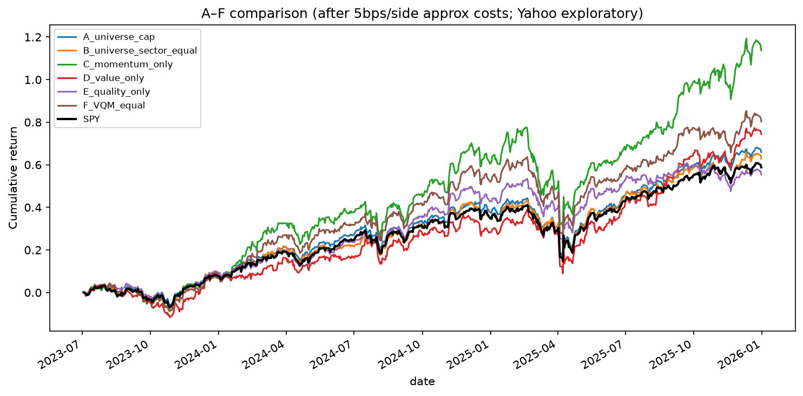
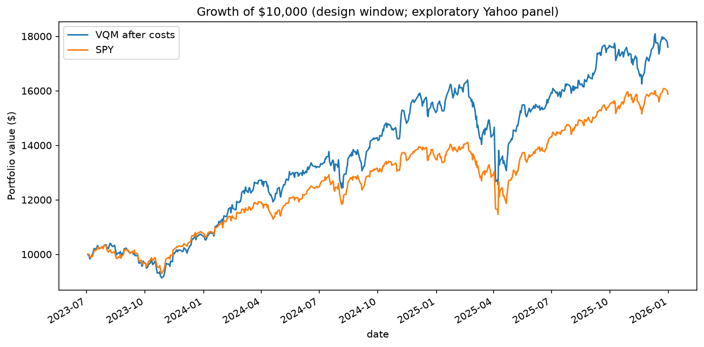
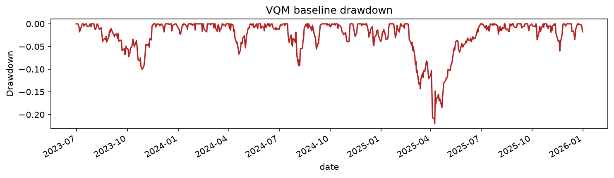
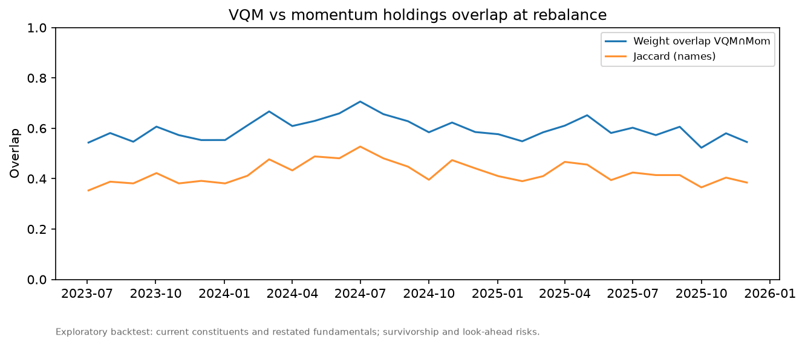
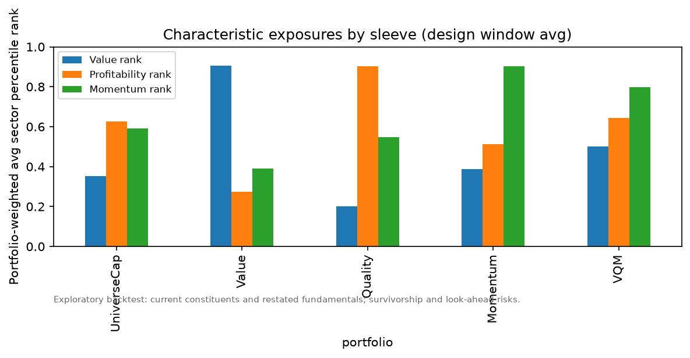
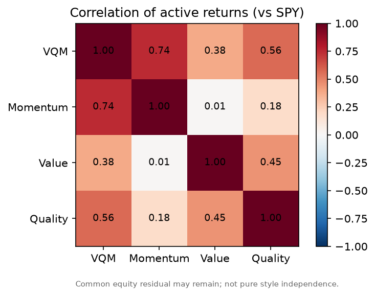

# Equity multifactor (VQM) — B9339 HW2

Systematic **long-only U.S. large-cap** mandate that balances **valuation**, **profitability**, and **price momentum** (VQM), with sector weights matched to the eligible universe at each monthly rebalance.

**Pitch objective:** illustrative **$10mm AUM** (not firm working capital), **conditional** on stronger point-in-time validation.  
**Research hypothesis:** complementarity — combining different information may reduce dependence on any single selection criterion.

| Submit | Path |
|--------|------|
| Printable deck (10 pages) | [`reports/slides/pitch_deck.pdf`](reports/slides/pitch_deck.pdf) |
| Self-contained HTML | [`reports/slides/pitch_deck.html`](reports/slides/pitch_deck.html) |
| Readable appendix | [`reports/APPENDIX.md`](reports/APPENDIX.md) |
| Decision memo | [`reports/STRATEGY_DECISION.md`](reports/STRATEGY_DECISION.md) |

---

## Data we used

| Input | Source | Notes |
|-------|--------|-------|
| Daily prices (OHLCV + Adj Close) | Yahoo Finance (`yfinance`) | Cached under `data/raw/` (gitignored) |
| Fundamentals (book equity, net income, statement frequency) | Yahoo quarterly / annual statements | **Restated**, not as-reported point-in-time |
| Shares outstanding | Yahoo share history + balance-sheet lines | BS shares enter at **availability** = period_end + lag; `constant_latest` excluded from market-cap eligibility |
| Universe / sectors | Current S&P 500 research constituent list + current GICS | **Not** historical index membership; current sectors applied historically |
| Benchmark | SPY Adj Close | ETF expense ratio embedded in prices |
| Factor ETF comparator (separate product) | VLUE, QUAL, MTUM | Equal-weight monthly blend; **not** the stock track record |
| Risk-free rate | FRED DGS3MO | Yield → `/100/252` approximation |

**Design window (stock study):** 2023-07-03 → 2025-12-31 (628 daily observations).  
**Data label:** `BIASED_EXPLORATORY_YAHOO_CURRENT_CONSTITUENT_PANEL` — survivorship, membership, restatement, and sector-retrojection biases remain.

Licensed Sharadar / CRSP-Compustat was **not** used. A subscription alone does not make a pipeline point-in-time.

---

## Strategy rules (frozen baseline)

- **Value:** \(V = B / M\) (book / contemporaneous market cap)
- **Profitability proxy (“quality”):** annual NI / period-matched average book (vendor-labelled annual on Yahoo; not full balance-sheet strength)
- **Momentum:** \(M = P_{t-21}/P_{t-252}-1\) (trading sessions)
- **Composite:** equal-weight within-sector percentile ranks \(S=(V+Q+M)/3\); top ~20% per sector
- **Portfolio:** sector weights = eligible-universe **cap** weights at rebalance; equal-weight within sector; long-only; no leverage
- **Execution:** month-end signal close → trade **next session close**
- **Costs in tables below:** estimated **5 bps/side** proportional approximation; before management fees unless noted

---

## Main research results

After estimated trading costs of **5 bps per side**; before management fees (unless noted). Design window Jul 2023 – Dec 2025.

| Portfolio | CAGR | Ann. vol | Sharpe | Max DD | 1-way turnover |
|-----------|------|----------|--------|--------|----------------|
| **VQM** | **26.71%** | 18.04% | 1.13 | −22.87% | 27.63%* |
| Momentum-only | 35.64% | 21.18% | 1.32 | −26.36% | 27.49% |
| Value-only | 25.01% | 18.86% | 1.02 | −21.52% | 11.07% |
| Quality-only (profitability) | 19.36% | 15.67% | 0.90 | −19.83% | 7.12% |
| Eligible-universe cap-weight | 22.54% | 15.39% | 1.08 | −19.49% | 2.97% |
| SPY | 20.40% | 15.51% | 0.96 | −18.76% | — |
| VQM after +75 bps fee | 25.77% | 18.04% | 1.09 | −22.94% | 27.63%* |

\*Engine average including initial formation. Excluding formation ≈ **25.5%/month** (29 subsequent rebalances).  
High precision: [`outputs/tables/AF_comparison_summary.csv`](outputs/tables/AF_comparison_summary.csv).

**Reading:** vs momentum, VQM shows **lower observed volatility and maximum drawdown**, with lower return and Sharpe. Vs universe-cap, higher return with higher risk and only a modest Sharpe lift. After fees, Sharpe (~1.09) is essentially flat vs universe-cap (~1.08). A rationale for VQM does **not** automatically justify 75 bps.

### Complementarity checks

| Check | Result |
|-------|--------|
| VQM vs momentum name Jaccard (avg across 30 rebalances) | 42.3% |
| VQM vs momentum weight overlap | 59.7% |
| Momentum vs value weight overlap | 9.9% |
| VQM portfolio-weighted avg ranks (value / profitability / momentum) | 0.50 / 0.64 / 0.80 |
| Active-return corr (sleeve − SPY): value vs momentum | ≈ 0.01 |
| Active-return corr: VQM vs momentum | ≈ 0.74 |

Ranks support **momentum-tilted with additional profitability exposure**; value ~0.50 is near mid-universe (not a strong value tilt). Active returns = sleeve − SPY (not regression residuals).

### ETF factor blend (comparator only, longer sample)

Equal-weight VLUE/QUAL/MTUM after ~5 bps/side ≈ **14.43%** CAGR vs SPY ≈ **14.13%** (~2014–2026). Different product — not a substitute stock track record.

### Decision

**Keep VQM** as the product (criteria diversification under uncertainty). **Simplify** any claim that the fee is earned or that the book is ready to deploy on this exploratory sample. Full memo: [`reports/STRATEGY_DECISION.md`](reports/STRATEGY_DECISION.md).

---

## Major plots

Cumulative A–F comparison (after ~5 bps/side):



Growth of $10,000 — VQM vs momentum vs SPY:



VQM drawdown:



Holdings overlap VQM vs momentum (averages across rebalances):



Characteristic exposures by sleeve (portfolio-weighted avg ranks):



Correlations of active returns vs SPY:



Chart footnote for all stock figures: *Exploratory backtest: current constituents and restated fundamentals; survivorship and look-ahead risks.*

---

## Reproduce

```bash
python3 -m venv .venv
source .venv/bin/activate
pip install -r requirements.txt
export PYTHONPATH=$PWD/src MPLBACKEND=Agg

pytest tests/test_accounting.py -q
python scripts/run_decision_study.py          # uses cached data/raw
python scripts/build_complementarity_evidence.py

# Fresh download (network):
python scripts/run_research.py
```

Raw Yahoo caches live in `data/raw/` (not committed). Result tables/figures needed for the pitch are force-tracked under `outputs/`.

---

## Repo map

| Path | Role |
|------|------|
| `config.yaml` | Frozen baseline parameters |
| `src/sis_hw2/` | Data, signals, portfolio, backtest, metrics |
| `scripts/run_decision_study.py` | A–F comparison + decision artifacts |
| `scripts/build_complementarity_evidence.py` | Overlap / exposures / active-return corrs |
| `reports/slide_writeup.md` | Speaker notes |
| `reports/APPENDIX.md` | High-precision tables, definitions, sources |
| `outputs/tables/` | CSVs / JSON (≥5 decimals where relevant) |
| `outputs/figures/` | Charts above |

**Course:** B9339 Systematic Investment Strategies (Fall 2026).
